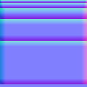

# MeshTopologyToolkit.TrimGenerator 

MeshTopologyToolkit.TrimGenerator is a command line utlity to generate textures and meshes inspired by Insomniac's Ultimate Trim.

To install the tool run the following command in a terminal:
```bash
dotnet tool install --global MeshTopologyToolkit.TrimGenerator
```

Then you can run the command from a terminal using short name:
```bash
>trimgen

Usage: trimgen [command]

MeshTopologyToolkit.TrimGenerator

Commands:
  normalmap    Generate trim normal map from trim height data.
  checkermap   Generate checker map.

Options:
  -h, --help    Show help message
  --version     Show version
```

## Checkerboard texture generation

Normal map texture generator for given trim heights.

```bash
Usage: trimgen normalmap [--trim-height <Int32>...] [--width <Int32>] [--width-in-units <Single>] [--bevel-width <Int32>] [--output <String>] [--help]

Generate trim normal map from trim height data.

Options:
  -t, --trim-height <Int32>...    Trim height in pixels (Required)
  -w, --width <Int32>             Texture width in pixels (Default: 1024)
  --width-in-units <Single>        (Default: 5)
  -b, --bevel-width <Int32>       Bevel width in pixels (Default: 8)
  -o, --output <String>           Output file name
  -h, --help                      Show help message
```

For example running
```bash
trimgen normalmap -t 4 -t 8 -t 16 -t 32 -t 64 -w 128
```

generates the following normal map:


## Checkerboard texture generation

Checkerboard is useful to test that your texture projection isn't distorted.

```bash
Usage: trimgen checkermap [--width <Int32>] [--height <Int32>] [--levels <Int32>] [--cell-size <Int32>] [--grid-levels <Int32>] [--output <String>] [--help]

Generate checker map.

Options:
  -w, --width <Int32>          Texture width in pixels (Default: 1024)
  -h, --height <Int32>         Texture height in pixels (Default: 1024)
  -s, --levels <Int32>         Maximum number of shades of gray, rounded to next power of 2 (Default: 8)
  -c, --cell-size <Int32>      Cell size in pixels (Default: 0)
  -g, --grid-levels <Int32>    Maximum number of grid levels, rounded to next power of 2 (Default: 0)
  -o, --output <String>        Output file name
  --help                       Show help message
```

